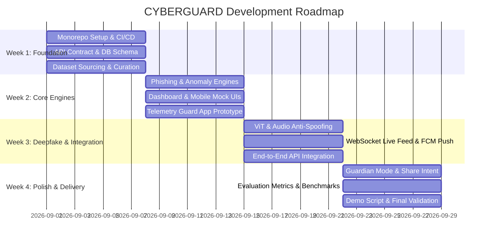

# CYBERGUARD — System Architecture & Project Context

> **Authoritative Reference Document for AI-Assisted Development**  
> *Domain:* Cybersecurity + Artificial Intelligence  
> *Mantra:* **SHIELD · DETECT · EXPLAIN · RESPOND**  
> *Status:* Prototype / MVP — Active Development  

---

## 1. Project Vision & Core Philosophy

CYBERGUARD is an AI-powered Security Operations Center (SOC) and personal defense platform engineered to detect, explain, and respond to modern digital threats: phishing scams, deepfakes, digital impersonation, credential theft, and suspicious system activity.

### The Problem
Attackers increasingly weaponize Generative AI to craft hyper-realistic phishing messages, cloned voices, deepfake media, and synthetic personas that bypass traditional signature- and rule-based defenses. Meanwhile, individuals and enterprise personnel remain vulnerable at the human layer. Traditional tools act like bouncers with static guest lists; when an AI-generated zero-day threat appears, it bypasses detection without explanation.

### The Solution & Core Philosophy
CYBERGUARD operates as an intelligent security expert analyzing **behavior, context, and intent**:
1. **Explainability Over Opaque Alerts:** Every threat includes a plain-English explanation detailing *why* it was flagged—never just a generic red badge.
2. **Granular Risk Scoring:** Replaces binary safe/block decisions with a 5-tier calibrated risk scale (`Safe` → `Low` → `Medium` → `High` → `Critical`).
3. **Prescriptive Action:** Provides concrete next steps (e.g., quarantine email, revoke session, inspect domain) rather than passive alerts.
4. **Dual-Layer Defense:** Protects both the **technology layer** (system logs, network telemetry, authentication events) and the **human layer** (deceptive messages, social engineering, synthetic media).

---

## 2. Target Users & Experience Profiles

| User Profile | Scope & Key Experience |
|---|---|
| **Individual Users** | On-demand scanning of suspicious messages, URLs, and media via Web or Mobile Share-Sheet; automated login alerts; personal incident history. |
| **At-Risk Users & Guardians** | Linked "Guardian Mode" pairing less tech-literate users with designated family members/guardians who receive escalated alerts and plain-language action prompts. |
| **Enterprise / SOC Teams** | Centralized Command Dashboard with organization-wide threat visibility, telemetry monitoring, incident triage/investigation workflows, and targeted service analytics. |
| **Evaluators & Judges** | Live demonstrable prototype validating real-time detection, scoring, explanation, and response across 6 threat scenarios. |

---

## 3. Threat Scenarios & Detection Engines

CYBERGUARD employs specialized, decoupled detection engines coordinated via a unified scoring pipeline:

| Threat Scenario | Engine Responsible | Primary Signals & Methods |
|---|---|---|
| **1. Phishing** (Email, SMS, Social DM, QR) | `Content Analysis Engine` + `URL/Website Analysis Engine` | LLM zero/few-shot semantic analysis, NLP intent parsing, offline TF-IDF + Logistic Regression/XGBoost fallback. |
| **2. Deepfake Detection** (Image, Audio, Video) | `Multimedia Authenticity Engine` | Pretrained Vision Transformers (ViT) for synthetic artifact detection; ASVspoof-trained voice anti-spoofing models; periodic frame-sampling for video. |
| **3. Digital Impersonation** (Brands, Officials, VIPs) | `Identity/Impersonation Engine` | Rules-based heuristics fusing text signals, sender metadata, SPF/DKIM/DMARC verification, and visual brand assets. |
| **4. Credential Theft & Account Takeover** | `Login/Behavioural Anomaly Engine` | Telemetry from Guard App (login timing, geo-velocity, new device fingerprints, failed attempts) fed into Isolation Forest. |
| **5. Malicious URLs & Websites** | `URL/Website Analysis Engine` | Google Safe Browsing / Web Risk API, VirusTotal reputation, WHOIS domain age, Levenshtein distance for look-alike domains. |
| **6. Technical Threats & System Anomalies** | `System Behaviour Engine` | Guard App telemetry monitoring process spikes, unauthorized outbound connections, and suspicious execution patterns. |

---

## 4. System Architecture & End-to-End Data Flow

CYBERGUARD adopts a **Dual-Backend Micro-Architecture** separating client gateway concerns from heavy machine learning workloads.

```
                  ┌──────────────────────────────────────────────┐
                  │                 CLIENT LAYER                 │
                  │  React Command Dashboard  |  Expo Mobile App │
                  └───────────────────────┬──────────────────────┘
                                          │ HTTPS / WSS
                                          ▼
                  ┌──────────────────────────────────────────────┐
                  │           GATEWAY (Node.js / Express)        │
                  │  • JWT Auth & RBAC (Individual / Enterprise) │
                  │  • PostgreSQL State Management & Audit Log   │
                  │  • WebSocket Broadcast Engine (Live Push)    │
                  │  • Internal Service Orchestrator             │
                  └──────────────┬───────────────────────────────┘
                                 │ Internal HTTP (Private Network)
                                 ▼
                  ┌──────────────────────────────────────────────┐
                  │          AI SERVICE (Python / FastAPI)       │
                  │  • Phishing / NLP Text Classifier            │
                  │  • Pretrained ViT & Audio Spoof Detectors    │
                  │  • Isolation Forest Anomaly Engine           │
                  │  • LLM Explanation & Response Generator      │
                  └──────────────────────────────────────────────┘
                                 ▲
                                 │ HTTPS Telemetry Heartbeats
                  ┌──────────────┴──────────────────────────────┐
                  │       TELEMETRY SENSOR ("Guard App")        │
                  │  • Lightweight Python Background Collector  │
                  │  • Login Events, Processes, Network Spikes  │
                  └──────────────────────────────────────────────┘
```

### End-to-End Data Flow (Observation → Delivery)
1. **Observation:** Telemetry arrives via client file upload, pasted text/URL, or Guard App background daemon.
2. **Ingestion & Auth:** Node.js API gateway validates session, logs initial transaction, and dispatches payload to internal FastAPI worker.
3. **Detection:** FastAPI routes data to the corresponding ML model or reputation aggregator.
4. **Risk Scoring:** Outputs normalized onto the unified 0–100 scale and mapped to 1 of 5 risk tiers.
5. **Explanation Generation:** LLM generates a human-readable diagnosis and maps to MITRE ATT&CK techniques.
6. **Response Formulation:** Engine attaches prescriptive remediation actions.
7. **Delivery & Persistence:** Node.js writes results to PostgreSQL, broadcasts incident via WebSocket to connected dashboards, and fires FCM mobile push notifications.

---

## 5. Technology Stack

### Web Frontend (Command Dashboard)
- **Framework:** React 18+ (Vite or Next.js SPA)
- **Styling:** Tailwind CSS + Radix UI primitives via **shadcn/ui**
- **Data Visualization:** Recharts (risk timeline, incident breakdown, telemetry graphs)
- **Micro-Animations:** Framer Motion (restrained, functional transitions; no playful animations)
- **Prototyping Standard:** Google Stitch used strictly for wireframing; final code is built directly in React/Tailwind.

### Mobile Application (Individuals & Guardians)
- **Framework:** React Native via **Expo**
- **Push Notifications:** Firebase Cloud Messaging (FCM) through Expo Notifications
- **Accessibility / TTS:** `expo-speech` for automated read-aloud warnings on High/Critical events
- **Native Integrations:** Mobile OS Share Sheet intent (Universal Message Checking from WhatsApp, Telegram, SMS)
- **Voice Action:** Scoped voice command handler ("Ask CyberGuard: check this message")

### Backend API Gateway
- **Runtime:** Node.js (v18+) with Express
- **Database:** PostgreSQL (Cloud-hosted)
- **Real-time Protocol:** WebSockets (`ws` or `socket.io`)
- **Authentication:** JWT with role claims (`individual`, `enterprise_admin`, `guardian`)

### AI / ML Microservice
- **Runtime:** Python 3.10+ with FastAPI & Uvicorn
- **ML & NLP Stack:** Hugging Face Transformers (`pipeline`, ViT models), `scikit-learn` (Isolation Forest), `xgboost`, PyTorch
- **External Security APIs:** Google Safe Browsing / Web Risk API, VirusTotal API, WHOIS Lookups

### Telemetry Collector ("Guard App")
- **Implementation:** Standalone Python script/daemon utilizing `psutil`, `socket`, `platform`
- **Footprint:** Passive sensor packaging JSON telemetry over HTTPS; contains zero heavy inference logic.

---

## 6. Detailed Backend & API Architecture

### Codebase Organization (Production Layered Pattern)
Both Node.js and Python services strictly enforce separation of concerns:
```
services/backend/src/
├── routes/        # Endpoint definitions only (URI, HTTP method, middleware attachments)
├── controllers/   # Request/response lifecycle, parameter unpacking, service delegation
├── middlewares/   # JWT verification, RBAC guard, input validation, error handling
├── models/        # Prisma/TypeORM/pg database schemas (User, Incident, RiskScore, Org)
└── utilities/     # Crypto helpers, formatters, standardized response wrappers
```

### Standard Unified Response Contract
All detection engines return results adhering to this standardized schema:
```json
{
  "incident_id": "inc_9823f4a1",
  "timestamp": "2026-09-08T18:14:00Z",
  "threat_scenario": "PHISHING_TEXT",
  "risk_tier": "High",
  "risk_score": 84,
  "mitre_attack": {
    "technique_id": "T1566.002",
    "technique_name": "Phishing: Spearphishing Link"
  },
  "explanation": "High Risk: The sender address mimics a major banking portal with typo-squatted domain. Urgency language demands immediate password reset within 1 hour.",
  "recommended_action": "Quarantine email, block domain '*.secure-login-alert.com', and trigger mandatory MFA prompt on next login.",
  "signals": {
    "sender_reputation": "Suspicious",
    "dmarc_aligned": false,
    "urgency_score": 0.92,
    "target_domain_age_days": 3
  }
}
```

---

## 7. Unified Risk Scoring Framework

Every detection engine maps raw probabilities into the unified 5-tier CYBERGUARD scale:

| Tier | Score Range | Operational Meaning | Automated System Response |
|---|---|---|---|
| **Safe** | 0 – 19 | Verified benign, trusted origin, no deceptive patterns. | Pass-through; log for audit trail. |
| **Low** | 20 – 39 | Minor anomalies (e.g., new device, off-hour login) without malicious indicators. | Informational notice on dashboard; standard logging. |
| **Medium** | 40 – 69 | Moderate risk indicators (e.g., unknown domain, mild urgency cues). | Advisory alert; recommend caution; flag for review. |
| **High** | 70 – 89 | Strong attack signatures (e.g., look-alike domain, high deepfake probability). | Proactive alert; read-aloud trigger on mobile; suggest immediate block/quarantine. |
| **Critical** | 90 – 100 | Confirmed active threat (e.g., known malicious payload, synthetic voice fraud, credential theft cluster). | Emergency alert to user & Guardian; automated session lock / domain block. |

---

## 8. Open-Source AI/ML Model Strategy

1. **Phishing & Scam Text:** Few-shot prompted LLM for zero-day social engineering and slang detection; fallback to local TF-IDF + Logistic Regression/XGBoost for offline/fast-path scoring.
2. **Deepfake Media:** Hugging Face pretrained Vision Transformer (ViT) deepfake classifiers running locally.
3. **Deepfake Audio:** Pretrained voice anti-spoofing models benchmarked on the ASVspoof dataset.
4. **Behavioral Telemetry:** `IsolationForest` from `scikit-learn` trained on synthetic + curated system baseline metrics.
5. **Async Processing:** Model inference runs asynchronously inside FastAPI. Client receives immediate ticket acknowledgement (`"Analysing..."`) with real-time result delivery over WebSockets.

---

## 9. Mobile Architecture & Guardian Mode

- **Universal Message Checking:** Leverages the OS Share Menu. Users share suspicious text, images, or links directly from WhatsApp/Telegram into CyberGuard without copy-pasting.
- **Dual-Wording Push Notifications:**
  - *To Individual:* Clear, non-technical warning with simple button: *"Potential scam detected. Do not click links."*
  - *To Linked Guardian:* Context-rich breakdown: *"Critical Alert for Alex: Deceptive banking message detected. Attack type: Credential Harvesting."*
- **Accessibility Read-Aloud:** `expo-speech` activates automatically on High/Critical notifications for non-tech-savvy or elderly users.

---

## 10. Monorepo Folder Structure

```
cyberguard/
├── .agents/
│   └── PROJECT_CONTEXT.md          # This authoritative specification
├── apps/
│   ├── web/                        # React / Tailwind / shadcn Command Dashboard
│   └── mobile/                     # React Native (Expo) Mobile Application
├── services/
│   ├── backend/                    # Node.js / Express API Gateway & WebSocket Server
│   │   ├── src/
│   │   │   ├── routes/
│   │   │   ├── controllers/
│   │   │   ├── middlewares/
│   │   │   ├── models/
│   │   │   └── utilities/
│   │   └── package.json
│   ├── ml-service/                 # Python / FastAPI AI Detection Engines
│   │   ├── engines/
│   │   │   ├── phishing/
│   │   │   ├── multimedia/
│   │   │   ├── impersonation/
│   │   │   └── anomaly/
│   │   ├── main.py
│   │   └── requirements.txt
│   └── guard-app/                  # Lightweight Python Telemetry Sensor Daemon
├── docs/                           # Architecture, MITRE ATT&CK mappings, API specs
└── README.md
```

---

## 11. Team Structure & Workstream Ownership

| Member / Role | Workstream Domain | Core Deliverables |
|---|---|---|
| **Backend Lead** | Gateway & System Infrastructure | Node.js/Express gateway, PostgreSQL schema, JWT RBAC, WebSocket engine, FastAPI orchestrator, production deployment. |
| **AI Lead (Subrat)** | AI Detection Engines | FastAPI services: phishing text, deepfake image/audio detectors, impersonation logic, LLM explanation pipeline. |
| **Data Lead (Sudhanshu)** | Data Engineering & Sensors | Threat scenario dataset curation, synthetic telemetry generation, Guard App collector, model accuracy benchmarking. |
| **Web Frontend (Teammate 4)** | Command Dashboard | React dashboard, live incident feed, risk timeline, Recharts visualization, enterprise/individual role views. |
| **Mobile Frontend (Teammate 5)** | Mobile & Guardian App | React Native/Expo app, FCM push notifications, Read-Aloud alerts, Share-Sheet integration, Guardian Mode UI. |

---

## 12. Development Roadmap & Priorities



### Pragmatic Engineering Boundaries
- **Deepfake Models:** Leverage established pretrained models (e.g., Hugging Face ViT, ASVspoof weights) rather than training foundation models from scratch.
- **Video Streams:** Use periodic keyframe extraction rather than full real-time video streaming pipelines.
- **Malware Scope:** Focus on process anomalies and network connection indicators from the Guard App rather than kernel-level sandbox execution.
- **Sensitive Content (Blackmail/Sextortion):** Provide direct crisis response guidance and official reporting links rather than automated content parsing.
