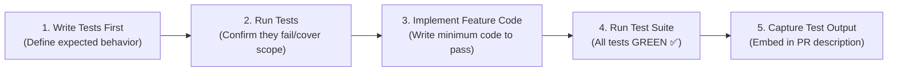

# CYBERGUARD — Development Workflow & Test-Driven Development (TDD) Guide

> **Mentor Mandate for all PRs:**  
> *"I can't check every code line by line. I want you to write test cases first and add test results / screenshots at the end of every PR. Ask your Antigravity / Cursor to add test cases before every feature you add. We follow the TDD (Test-Driven Development) method so I can happily merge the code if required test cases pass."*

---

## 1. The TDD (Test-Driven Development) Cycle

For every new feature, API route, or ML engine:



1. **Write Test Cases First:** Before implementing business logic, write automated tests in `tests/` defining the expected behavior, edge cases, and boundary conditions.
2. **Implement Feature Code:** Write the logic in `services/` or `controllers/` to satisfy the tests.
3. **Verify Execution:** Run `pytest` or `npm test` locally. Fix any failures until all tests pass with 100% green status.
4. **Capture Test Results:** Copy the test summary output or capture a terminal screenshot. This will be pasted into the PR body.

---

## 2. Standard Git Workflow (Step-by-Step)

### Phase 1: Start From Latest `dev`
Always branch off the latest integration code from `dev`:
```bash
# 1. Switch to dev and pull latest remote changes
git checkout dev
git pull origin dev

# 2. Cut a new feature branch
git checkout -b feature/<task-name>
# Examples: feature/ctu13-preprocessing, feature/login-rate-limiting, fix/auth-token-expiry
```

---

### Phase 2: TDD Implementation & Testing

#### For ML Service (`services/ml-service/`):
```bash
cd services/ml-service

# 1. Create or edit test file under tests/ (e.g. tests/test_ctu13_preprocessor.py)
# 2. Implement feature logic under app/services/ or app/engines/
# 3. Run the automated test suite
python -m pytest tests/ -v
```

#### For Backend API (`services/backend/`):
```bash
cd services/backend

# Run unit / route tests
npm test
```

#### For Web Frontend (`apps/web/`):
```bash
cd apps/web

# Check build and linting
npm run build
```

---

### Phase 3: Stage and Commit Changes
Inspect files before staging to ensure no secrets (`.env`) or large binary datasets are staged:
```bash
# 1. Check modified and untracked files
git status

# 2. Stage ONLY relevant code and test files
git add <file1> <file2> <tests/...>

# 3. Commit using conventional commit message format
git commit -m "feat: implement CTU-13 network flow feature preprocessor with unit tests"
```

**Commit message prefixes:**
* `feat:` new feature or detection capability
* `test:` adding or updating test cases
* `fix:` bug fixes
* `docs:` documentation or contract changes
* `refactor:` code restructuring without behavior changes

---

### Phase 4: Sync with Latest `dev` Before Pushing
Prevent merge conflicts by rebasing or merging upstream `dev`:
```bash
git fetch origin dev
git merge origin/dev
```

---

### Phase 5: Push Branch to GitHub
```bash
git push -u origin feature/<task-name>
```

---

### Phase 6: Raise Pull Request with Test Proof
1. Open the GitHub repository URL printed in your terminal.
2. Set branches: **`base: dev`** $\leftarrow$ **`compare: feature/<task-name>`**.
3. Fill out the PR using the mandatory mentor template below:

```markdown
### Summary of Changes
- Briefly describe the feature or bugfix implemented.

### TDD & Test Suite Verification (Required by Mentor)
- [x] Automated test cases written before / alongside implementation
- [x] All test suites passing locally

**Test Execution Output / Proof:**
```text
============================= test session starts =============================
platform win32 -- Python 3.11.x, pytest-8.x.x
collected 8 items

tests/test_login_anomaly.py ........                                     [100%]

============================== 8 passed in 1.24s ==============================
```
*(Or attach terminal screenshot here)*

### Affected Components
- [ ] Web Frontend (`apps/web`)
- [ ] Mobile App (`apps/mobile`)
- [ ] Backend Gateway (`services/backend`)
- [x] ML Service (`services/ml-service`)
- [ ] Documentation (`docs/`)

### Contract Compliance
- [ ] Follows layered architecture (no business logic in routes)
- [ ] Follows standard risk-scoring format (`risk_level`, `explanation`, `recommended_action`)
- [ ] Zero secrets or `.env` files committed
```

---

### Phase 7: Post-Merge Cleanup (After PR Merged into `dev`)
```bash
# Switch back to local dev and pull newly merged changes
git checkout dev
git pull origin dev

# Delete local feature branch
git branch -d feature/<task-name>
```

---

## 3. How to Prompt Antigravity / Cursor for Automatic TDD & Git Instructions

Copy and paste this prompt snippet whenever delegating a task to Antigravity:

> *"Implement `<feature_name>`. Follow our team's TDD mandate from `docs/DEVELOPMENT_WORKFLOW_AND_TDD.md`: write automated test cases first in `<test_path>`, run the tests, implement the feature code until all tests pass, and finally provide the exact git commands (pull, branch, stage, commit, push) and the PR description with the passing test results."*
