# CYBERGUARD Architecture Overview

## Purpose
CYBERGUARD is an AI-powered cybersecurity platform designed for enterprises. It detects threats across email, web, endpoints, and credentials, analyzes risk with explainable ML, recommends responses through configurable policies, and records every security decision in an append-only audit trail.

---

## System Architecture

> [!NOTE]
> Interactive Architecture Diagram Artifact:
> [cyberguard-system.html](file:///c:/Users/subha/Downloads/CyberGuard/.archify/architecture-cyberguard-system-20260929-103100/cyberguard-system.html)
> *(Rendered with Archify 3.0: supports theme switching, SVG trace motion, component containment, and inspection cards)*

### Component & Boundary Overview

```mermaid
flowchart TB
  subgraph PresentationLayer["1. Presentation Layer (Frontend)"]
    WebDash["Web Dashboard (React / Vite) [Completed]"]
    MobileApp["Mobile App (React Native) [Completed]"]
    GuardApp["Guard App Sensor (Desktop Agent) [Future]"]
  end

  subgraph GatewayLayer["2. API Gateway & Security"]
    RateLimiter["Rate Limiters (Tiered 5/100/300) [Completed]"]
    APIGateway["Express API Gateway (Node.js) [Completed]"]
    AuthRBAC["Auth & RBAC (JWT 15m/7d) [Completed]"]
    WebSocket["WebSocket Server (Socket.io) [Completed]"]
  end

  subgraph TriageLayer["3. Incident Triage & Ingestion"]
    CheckCtrl["Check Controller (/check/*) [Completed]"]
    MLClient["ML Client (Axios) [Completed]"]
    IncidentSvc["Incident Service (Atomic Tx) [Completed]"]
    AdminCtrl["Admin Controller (Approvals) [Completed]"]
  end

  subgraph MLLayer["4. ML Inference & 5 Detection Engines"]
    MLGW["FastAPI ML Service (:8000) [Completed]"]
    EngPhishing["Phishing Engine (NLP + Keywords) [Completed]"]
    EngURL["URL Engine (Lexical + Reputation) [Completed]"]
    EngMedia["Deepfake Engine (Audio/Visual ViT) [Completed]"]
    EngAnomaly["Login Anomaly (Isolation Forest) [Completed]"]
    EngSecrets["Secret Exposure (Regex + Entropy) [Completed]"]
  end

  subgraph ExternalLayer["5. External & Future Integrations"]
    ExtIntel["Google Safe Browsing & VirusTotal [Completed]"]
    ExtAbuse["AbuseIPDB API [Completed]"]
    ExtMitre["MITRE ATT&CK Taxonomy [Completed]"]
    ExtFirewall["Firewall Blocklist Feed [Future]"]
    ExtSIEM["SIEM Export (Syslog/Webhooks) [Future]"]
    ExtEmail["Email Provider (SendGrid/SMTP) [Completed]"]
    ExtFCM["Firebase Cloud Messaging (Push) [Completed]"]
  end

  subgraph ResponseLayer["6. Response & Remediation Layer (Phase 2)"]
    PolicyEng["Policy Engine (Configurable per-org) [Shadow Mode]"]
    ResponseActions["Response Actions (Action State Machine) [Phase 2]"]
    ExecutionSvc["Execution Service (Live Remediation) [Completed]"]
    AuditSvc["Audit Logging Service (Append-Only) [Completed]"]
    NotificationSvc["Notification Service (Alert Dispatcher) [Completed]"]
  end

  subgraph DataLayer["7. Data & Persistence Layer"]
    StoreMedia["Supabase Storage (Media Buckets) [Completed]"]
    DBRedis["Redis (Cache, Blacklist, Blocked IPs) [Completed]"]
    DBRLS["Row Level Security (Tenant & Guardian RLS) [Completed]"]
    DBPostgres["PostgreSQL (Incidents, Actions, Audit) [Completed]"]
  end

  %% Flow connections
  WebDash & MobileApp -->|HTTPS / REST| APIGateway
  GuardApp -.->|Telemetry Stream| APIGateway
  APIGateway --> RateLimiter & AuthRBAC
  APIGateway --> CheckCtrl & AdminCtrl

  CheckCtrl --> MLClient --> MLGW
  MLGW --> EngPhishing & EngURL & EngMedia & EngAnomaly & EngSecrets
  EngURL --> ExtIntel
  EngAnomaly --> ExtAbuse

  CheckCtrl --> IncidentSvc
  IncidentSvc --> DBPostgres
  IncidentSvc --> WebSocket
  WebSocket --> WebDash & MobileApp
  IncidentSvc -.-> ExtMitre

  %% Two-Step Approval & Execution Flow
  IncidentSvc ==>|1. Evaluate Threat Rules| PolicyEng
  PolicyEng ==>|Propose Action| ResponseActions
  AdminCtrl ==>|2. Admin Approval| ResponseActions
  ResponseActions ==>|3. Trigger Live Execution| ExecutionSvc

  ExecutionSvc -->|Revoke Tokens / Block IPs| DBRedis
  ExecutionSvc -->|Suspend Device Status| DBPostgres
  ExecutionSvc ==>|Append Decision Log| AuditSvc
  AuditSvc --> DBPostgres
  PolicyEng & ExecutionSvc --> NotificationSvc
  NotificationSvc --> ExtEmail & ExtFCM
  ExecutionSvc -.->|Dynamic Blocklist Feed| ExtFirewall
  AuditSvc -.->|Syslog Forward| ExtSIEM
```

### Color Coding & Lifecycle Conventions
- **Green (`Completed / Production`)**: Active components passing regression suites and deployed in backend/gateway/ML service.
- **Yellow (`In-Progress / Shadow Mode`)**: Policy Engine evaluating decisions in shadow mode without live side-effects until explicitly approved.
- **Red / Dashed (`Future / Roadmap`)**: Host sensors, dynamic firewall feeds, SIEM webhooks, and rollback queues planned for subsequent releases.

### Two-Step Approval Workflow
1. **Detection & Proposal**: When an incident score exceeds policy thresholds, the **Policy Engine** evaluates per-organization rules and creates a `proposed` or `pending_approval` response action record.
2. **Admin Review & Approval**: Organization administrators inspect the incident, threat signals, and recommended action in the dashboard, triggering `POST /api/v1/admin/actions/:id/approve`.
3. **Execution & Audit**: The admin (or auto-execute policy) calls `POST /api/v1/admin/actions/:id/execute`. The **Execution Service** runs strict safety guardrails, triggers remediation handlers (token revocation, IP blocking, device suspension), and persists an immutable entry to `audit_logs`.

---

## Detection Engines

### Phishing Detection
Analyzes emails and messages for phishing indicators using NLP and keyword detection. Risk scoring based on sender reputation, content patterns, and suspicious links.

### URL Threat Detection
Checks suspicious URLs using lexical analysis (entropy, domain impersonation) and external reputation APIs (Google Safe Browsing, VirusTotal). Cached for 24 hours to reduce API calls.

### Deepfake Detection
Analyzes uploaded media (images, audio) for signs of manipulation using audio/visual forensics. Returns confidence scores and detection signals.

### Login Anomaly Detection
Detects suspicious authentication behavior using Isolation Forest ML model trained on normal login patterns. Flags unusual times, locations, or device patterns.

### Secret Exposure Detection
Finds exposed API keys, passwords, database URIs, private keys, and tokens in logs, uploads, and environment data. Critical for preventing credential compromise.

---

## Response & Remediation Layer

### Policy Engine
Configurable, per-organization policies that map threat types and risk scores to response actions. Example: `"phishing + score >= 85 → revoke session, notify admin"`. Operates in **SHADOW MODE** by default (calculates but doesn't execute) to prevent false positives.

### Response Actions
Tracks proposed, pending approval, approved, rejected, executed, and failed actions. Includes full audit trail of who approved/rejected and when. Supports auto-execute timers for time-sensitive responses.

### Execution Service
Actually carries out approved actions:
- Revoke active sessions (via token blacklist)
- Block IPs/domains (Redis-backed blocklist)
- Suspend devices (mark as inactive)
- Force password resets (7-day notification)
- Protected-target guardrails prevent accidental lockouts

### Audit Logging
Append-only, immutable log of every security decision. Records:
- What threat was detected
- What policy was applied
- Who approved/rejected
- What action was taken
- Full result and timestamps

### Notification Service
Sends email alerts to admins when:
- Critical/high threats detected
- Action awaits approval
- Action was executed (success or failure)
- Logs are available for review

---

## Current Status (Oct 2026)

### Completed Features
✅ Multi-tenant architecture with organization & user isolation  
✅ JWT authentication (15-min access, 7-day refresh tokens)  
✅ Role-based access control (admin, employee, individual)  
✅ Phishing detection engine  
✅ URL threat analysis with reputation caching  
✅ Deepfake detection for images/audio  
✅ Login anomaly detection (Isolation Forest model)  
✅ Secret exposure detection (API keys, passwords, tokens)  
✅ MITRE ATT&CK mapping for all incidents  
✅ Policy engine (shadow mode, configurable per org)  
✅ Response action tracking (proposed → approved → executed)  
✅ Audit logging (append-only, immutable)  
✅ Email notifications for critical events  
✅ WebSocket real-time alerts  
✅ Live action execution (revoke, block, suspend, reset)  
✅ Redis caching for API quota optimization  
✅ Rate limiting (tiered by endpoint criticality)  
✅ Guardian Mode (supervise employees, two-party consent)  
✅ Direct-to-Supabase media uploads  

### In Progress / Planned for Phase 2
🔄 Desktop Guard Agent (Windows/Mac agent for endpoint telemetry)  
🔄 Background action scheduler (auto-execute on timer)  
🔄 Rollback mechanism (undo executed actions)  
🔄 Advanced malware detection  
🔄 Firewall integration (dynamic blocklist feed)  
🔄 SIEM export (Splunk, Sentinel, syslog webhooks)  
🔄 Ticketing integration (Jira, ServiceNow)  
🔄 SSO/SAML for enterprise identity  
🔄 Alert correlation and deduplication  

---

## Technology Stack

### Backend
- **Runtime:** Node.js + Express
- **Database:** PostgreSQL (Supabase)
- **Cache:** Redis
- **Storage:** Supabase Storage (media files)
- **Real-time:** Socket.io (WebSocket alerts)
- **Auth:** JWT (15m access, 7d refresh)

### ML & Detection
- **Framework:** FastAPI (Python)
- **Models:** 
  - Phishing: NLP (keyword + pattern matching)
  - URL: Lexical analysis + external APIs
  - Deepfake: Audio/visual forensics
  - Anomaly: Isolation Forest (scikit-learn)
  - Secrets: Regex + entropy detection
- **External APIs:** Google Safe Browsing, VirusTotal, AbuseIPDB

### Frontend (Coming Soon)
- **Web:** React + Tailwind + shadcn/ui
- **Mobile:** React Native
- **Desktop Agent:** Python + Electron (planned)

---

## Deployment

Currently deployed on:
- **Backend & ML:** Render (free tier with Redis)
- **Database:** Supabase PostgreSQL
- **Real-time:** Socket.io over HTTPS
- **Storage:** Supabase Storage

Scaling ready: stateless API, Redis pub/sub for distributed Socket.io, read replicas for Postgres.

---

## Security Highlights

- **Tenant Isolation:** Row-level scoping enforced at DB + application layer
- **Audit Trail:** Every action logged, immutable, tied to actor
- **Shadow Mode:** Test policies safely before live execution
- **Protected Targets:** Built-in blocklist prevents dangerous auto-actions
- **Retry Limits:** Auto-actions capped per hour; exceeding triggers manual review
- **Secrets Scrubbing:** Passwords, tokens never logged or exposed in errors
- **Role-Based Access:** Admins can approve/reject, employees can't self-remediate
